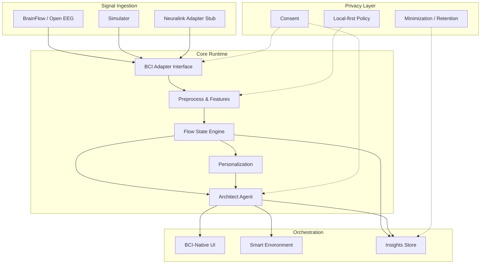

# Neural Flow Architect

**Version 0.2.0 – Daily-driver foundation**  
**Date: July 2026**

> A closed-loop, proactive AI co-pilot for high-bandwidth brain–computer interface (BCI) users — designed to detect, protect, deepen, and help re-enter **flow states**, then orchestrate digital and physical environments so meaningful work can continue with less friction.

```
Neural signals → Flow model → Architect agent → Environment & UI
        ↑______________ personalization & consent ______________|
```

---

## Why this exists

People with Neuralink-class intracortical implants often spend **many hours per day** on computers — studying, creating, communicating, gaming, reclaiming independence. Current BCI software is largely **reactive input** (cursor, typing, basic control). Energy cost, fatigue, pain, and context switching still make deep engagement hard to start and harder to sustain.

**Neural Flow Architect** treats flow not as a wellness gimmick, but as a **first-class control objective**: sense multi-dimensional engagement from neural data, act proactively to protect it, and always leave the human in charge.

### Design principle

> Everything should feel like a **natural extension of the user’s own mind** — not another assistive gadget.

---

## Novelty & differentiation

As of mid-2026, no public product combines all of the following:

| Capability | Neural Flow Architect | Typical EEG focus apps | Motor BCI stacks | Research smart-home BMI |
|---|---|---|---|---|
| High-bandwidth intracortical-ready architecture | ✅ | ❌ | Partial | Rare |
| Multi-dimensional real-time **flow** modeling | ✅ | Focus only / coarse | ❌ | ❌ |
| **Proactive** agentic co-pilot (digital + physical) | ✅ | Reactive | Reactive | Limited / offline |
| Long-term personal **neural flow signatures** | ✅ | Weak | N/A | Limited |
| Built for **severe motor impairment**, all-day use | ✅ | Consumer wellness | Motor tasks | Lab demos |
| Local-first, open-source, adapter-based BCI layer | ✅ | Mixed | Mixed | Closed papers |

Closest systems (e.g. consumer EEG “focus” products, motor copilots, lab BMI home-control papers) are usually **non-invasive only**, **purely reactive**, **motor-control focused**, or **research-only**. This project is deliberately different: **flow-first, agentic, privacy-maximal, implant-class ready, usable today with open tools**.

See [docs/NOVELTY.md](docs/NOVELTY.md) for the full differentiation brief for contributors.

---

## Who it is for

**Primary:** People with Neuralink-class high-bandwidth implants (trial and future commercial users), especially those with quadriplegia, ALS, or other severe motor impairments.

**Secondary:** BCI researchers, open-source neurotech developers, caregivers/clinicians evaluating assistive workflows (non-clinical), and builders of privacy-preserving neural agents.

---

## Core principles (non-negotiable)

1. **High-bandwidth first** — Architecture ready for intracortical streams; usable today with open EEG / simulators.
2. **Proactive > reactive** — The system anticipates and acts; the user should not micromanage it.
3. **User always in control** — Transparent, overridable, never manipulative.
4. **Local-first & privacy-maximal** — Neural data is among the most sensitive biometrics.
5. **BCI-native UX** — Dwell / low-precision control, multimodal input, very low cognitive load.
6. **Modular & future-proof** — Swap BrainFlow ↔ Neuralink (or any) SDK via adapters.
7. **Open source by design** — Documented, contribution-friendly, ethical by default.

---

## What it does

### 1. Flow detection & modeling
Ingests neural signals (or simulator streams), estimates multi-dimensional flow-related state:

- Sustained attention / engagement  
- Reduced self-referential / default-mode-like activity (proxy features today)  
- Optimal arousal / effortless concentration signatures  
- Confidence scores and transitions: `pre_flow → flow → deep_flow → post_flow`  

Personalized models improve over time; quality degrades gracefully when signal is poor.

### 2. The Architect (proactive agent)
Continuously watches neural state + context (app, time, goals, history) and:

- **Protects** emerging/deep flow (UI simplify, notification shield, lighting/music/temp, queue micro-tasks)  
- **Helps re-entry** when flow breaks  
- **Prepares context** from subtle precursors of intent (predictive layer)  
- **Explains** every meaningful action in plain language  
- **Learns** preferences and honors instant override  

### 3. Environment & interface orchestration
Digital focus modes, adaptive density, task prioritization; physical IoT via standard protocols; future hooks for robotics, wearables, and BCI HID standards.

### 4. Insights & long-term learning
Post-session Flow Insights, longitudinal “what works for *you*”, gentle coaching, exportable privacy-respecting data.

---

## Architecture (high level)



Full design: [docs/architecture/SYSTEM_ARCHITECTURE.md](docs/architecture/SYSTEM_ARCHITECTURE.md).

---

## Status & disclaimer

**Status:** Public foundation / Phase 0–1 scaffolding. Research and assistive-technology software.

> ⚠️ **Not a medical device.** Neural Flow Architect is **not** intended to diagnose, treat, cure, or prevent any disease. It is not a regulated medical device unless and until appropriately cleared. Use at your own risk. Neural data is highly sensitive — default deployments process data **locally**.

This project is **independent** and not affiliated with Neuralink Corp. unless explicitly stated.

---

## Quick start (easy path for users & caregivers)

Requirements: **Python 3.11+**, macOS/Linux/Windows. Node optional (companion UI).

```bash
cd neural-flow-architect   # your clone path
python3 -m venv .venv
source .venv/bin/activate   # Windows: .venv\Scripts\activate
pip install -e ".[dev]"

nfa doctor                  # health check
nfa start                   # local API + clear next steps
nfa start --with-ui         # API + Vite UI (needs npm install in frontend/)
```

Companion UI (if not using `--with-ui`):

```bash
cd frontend && npm install && npm run dev
# open http://127.0.0.1:5173
# Onboarding → pick a daily preset → Start session
# Sticky controls: Pause · Undo · Rest
# Keyboard: P pause · F resume · U undo · R rest · S start
# Command bar: type “pause”, “undo”, “rest mode”
```

**Guides:** [docs/ux/USER_GUIDE.md](docs/ux/USER_GUIDE.md) · [docs/ux/CAREGIVER_SETUP.md](docs/ux/CAREGIVER_SETUP.md) · [docs/bci/NEURALINK_READINESS.md](docs/bci/NEURALINK_READINESS.md)

### Other commands

```bash
nfa demo --duration 30              # CLI closed loop
nfa demo --adapter replay --duration 30
nfa serve --adapter simulator       # API only
nfa serve --adapter neuralink_stub  # high-channel + intent practice

# BrainFlow (optional hardware / synthetic / file)
pip install -e ".[brainflow]"
NFA_ADAPTER=brainflow NFA_BRAINFLOW_BOARD_ID=-1 nfa serve
NFA_ADAPTER=brainflow NFA_BRAINFLOW_FILE=tests/fixtures/synthetic_eeg.csv nfa serve

nfa eval --duration 20 --recipe study
nfa bench --channels 8 --iterations 40
nfa contract --adapter simulator   # adapter golden suite
nfa contract --adapter replay
nfa report                         # trust + policy scoreboard
nfa report --json                  # machine-readable scoreboard
nfa soak --duration 300            # multi-minute simulated soak (fast wall clock)
```

Optional app-aware protection (local window titles only). Edit the map under
**Insights → App → category map** or `data/profiles/app_categories.json`:

```bash
NFA_DETECT_ACTIVE_APP=true nfa serve
```

Optional OS Focus / DND companion (dry-run by default — no system change until you opt in):

```bash
NFA_OS_FOCUS_ENABLED=true nfa serve
# live attempt only if you also set:
# NFA_OS_FOCUS_FORCE_DRY_RUN=false
# (macOS: Shortcuts named "NFA Focus On" / "NFA Focus Off")
```

**Fail-safe:** Pause always works; low quality / stream stall blocks proactive IoT.  
**Feedback:** In Why?, tap Helpful / Not helpful / Never — the co-pilot learns locally.

Optional BrainFlow hardware path:

```bash
pip install -e ".[brainflow]"
nfa stream --adapter brainflow
```

See [docs/roadmap/DAY1_PROTOTYPE.md](docs/roadmap/DAY1_PROTOTYPE.md) for the concrete first-hour plan.

---

## Repository map

```
neural-flow-architect/
├── README.md                 # You are here
├── TODO.md                   # Living build checklist
├── LICENSE                   # Apache-2.0
├── NOTICE
├── pyproject.toml
├── configs/                  # Default runtime configs
├── docs/                     # Product, architecture, ethics, roadmap
├── src/neural_flow_architect/
│   ├── adapters/             # BCI source adapters (sim, BrainFlow, Neuralink stub)
│   ├── signal/               # Preprocess + features
│   ├── flow/                 # Flow state machine + models
│   ├── agent/                # Architect agent, tools, policies
│   ├── environment/          # Digital + IoT orchestration
│   ├── personalization/      # Per-user learning
│   ├── insights/             # Sessions + longitudinal analytics
│   ├── privacy/              # Consent, retention, audit
│   ├── api/                  # Local API / WebSocket
│   ├── core/                 # Shared types, events, runtime
│   └── ui/                   # Terminal / headless UI helpers
├── frontend/                 # BCI-native web UI (scaffold)
├── prototypes/day1/          # Minimal runnable scripts
├── examples/                 # Notebooks / usage samples
├── tests/
└── scripts/
```

---

## Documentation index

| Document | Purpose |
|---|---|
| [docs/NOVELTY.md](docs/NOVELTY.md) | Differentiation for contributors |
| [docs/architecture/SYSTEM_ARCHITECTURE.md](docs/architecture/SYSTEM_ARCHITECTURE.md) | Layers, data flow, tech choices |
| [docs/agent/ARCHITECT_AGENT.md](docs/agent/ARCHITECT_AGENT.md) | Proactive co-pilot design |
| [docs/bci/ADAPTER_LAYER.md](docs/bci/ADAPTER_LAYER.md) | Open tools → Neuralink path |
| [docs/ux/UX_PRINCIPLES.md](docs/ux/UX_PRINCIPLES.md) | BCI-native UX + wireframes |
| [docs/privacy/PRIVACY_ETHICS.md](docs/privacy/PRIVACY_ETHICS.md) | Privacy, ethics, safety |
| [docs/roadmap/ROADMAP.md](docs/roadmap/ROADMAP.md) | Phased development |
| [docs/roadmap/DAY1_PROTOTYPE.md](docs/roadmap/DAY1_PROTOTYPE.md) | Build today with open tools |
| [docs/research/OPEN_QUESTIONS.md](docs/research/OPEN_QUESTIONS.md) | Risks & research next steps |
| [CONTRIBUTING.md](CONTRIBUTING.md) | How to contribute |
| [CODE_OF_CONDUCT.md](CODE_OF_CONDUCT.md) | Community standards |
| [SECURITY.md](SECURITY.md) | Vulnerability reporting |
| [TODO.md](TODO.md) | Build checklist |

---

## Contributing

We welcome researchers, implant users, caregivers, and engineers. Please read [CONTRIBUTING.md](CONTRIBUTING.md) and [docs/NOVELTY.md](docs/NOVELTY.md) before large design changes — **novelty and user control are load-bearing**.

Accessibility of contribution paths matters: issues labeled `good first issue`, `bci-ux`, `privacy`, and `flow-science` are great entry points.

---

## License

Apache License 2.0 — see [LICENSE](LICENSE).

---

## Human flourishing focus

Neural Flow Architect exists so people who have regained digital access through brain implants can spend more of their precious time in **deep, meaningful, high-agency states of flow** — with technology that amplifies will, never replaces it.
