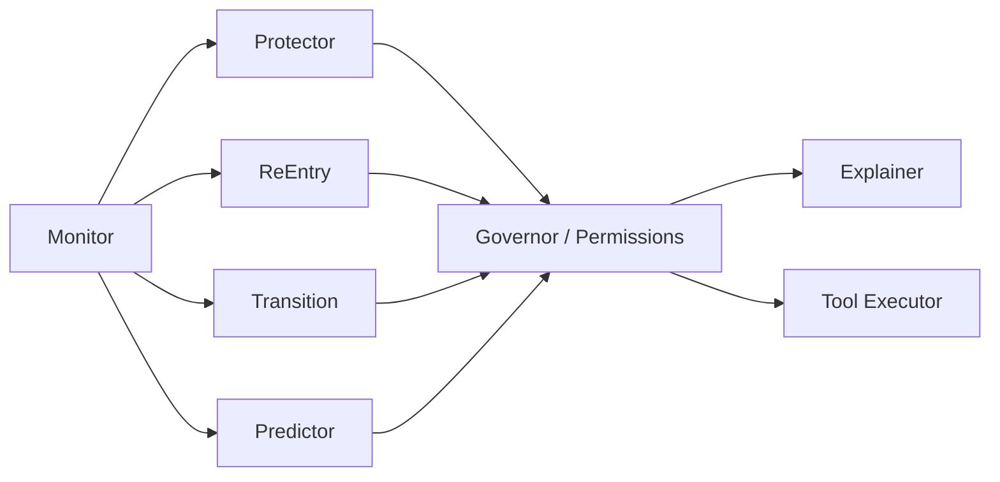

# Architect Agent Design Document

**Component:** Proactive Agentic Co-Pilot (“The Architect”)  
**Module:** `src/neural_flow_architect/agent/`

## 1. Purpose

The Architect continuously monitors estimated neural flow-related state and situational context, then **acts** to:

1. **Protect** emerging or established flow  
2. **Support re-entry** when flow breaks  
3. **Ease transitions** when the user is done or fatigued  
4. **Prepare context** when precursors suggest upcoming intent (Phase 2+)  

It is not a chat bot first. Chat is an optional interface; **closed-loop stewardship of flow** is the product.

## 2. Design principles

| Principle | Implementation implication |
|---|---|
| Proactive | Time-triggered + event-triggered policies, not only user prompts |
| Controllable | Global pause, per-tool deny, undo stack |
| Explainable | Every medium/high impact action has a human-readable reason |
| Least privilege | Tools declare impact tier; high impact needs confirmation or prior grant |
| Calm | Prefer fewer high-quality interventions over noisy micro-actions |
| Local | Rules engine default; LLM optional and non-blocking |
| Testable | Pure decision functions over snapshots |

## 3. Logical multi-agent structure

Preferred modular design (can run in one process as coordinated modules):



| Module | Role |
|---|---|
| **Monitor** | Fuse flow estimates, quality, context into `WorldSnapshot` |
| **Protector** | When pre_flow/flow/deep_flow: reduce friction |
| **ReEntry** | When break detected: gentle scaffold back |
| **Transition** | When post_flow/fatigued: wind-down, not force-focus |
| **Predictor** | Optional: precursor patterns → prepare (not force) |
| **Governor** | Permissions, rate limits, cooldowns, dry-run |
| **Explainer** | Natural language rationale from structured causes |

MVP may collapse Protector/ReEntry/Transition into one **PolicyEngine** with mode selection.

## 4. World snapshot

```python
# Conceptual schema (see code models for source of truth)
WorldSnapshot:
  time: datetime
  flow:
    state: FlowState
    engagement: float
    arousal_balance: float
    self_ref_proxy: float
    effort_ease: float
    confidence: float
    minutes_in_state: float
  quality:
    overall: float
    artifact_ratio: float
  context:
    active_app: str | None
    time_of_day: str
    user_goal: str | None
    focus_session_id: str | None
  preferences:
    protect_style: calm | assertive
    allow_iot: bool
    quiet_hours: ...
  recent_actions: list[ActionRecord]
```

## 5. Decision framework

### 5.1 Mode selection

```text
if quality.overall < Q_min or confidence < C_min:
    mode = idle_degraded
elif state in {flow, deep_flow} or (state == pre_flow and rising):
    mode = protect
elif state in {low, post_flow} and user_goal suggests work:
    mode = re_enter
elif state == fatigued or user signals stop:
    mode = transition
else:
    mode = idle
```

### 5.2 Action selection (utility sketch)

Score candidate tools by:

- Expected flow benefit  
- User preference affinity  
- Invasiveness cost  
- Recency penalty (cooldown)  
- Permission availability  

Execute top-k (usually 1–3) under budget.

### 5.3 Safety constraints

- Never disable emergency communication channels  
- Never lock the user out of override  
- No infinite notification suppression without visible status  
- Physical actuators require `allow_iot` + scope consent  
- High-impact tools: confirm unless user granted sticky permission  
- Rate limit: max N medium actions / 10 minutes (configurable)  

## 6. Tool catalog (v1)

Tools live in `agent/tools/` and register with metadata.

### 6.1 Digital tools

| Tool ID | Impact | Description |
|---|---|---|
| `ui.set_density` | low | Simplify companion UI chrome |
| `ui.show_status` | low | Calm flow indicator only |
| `notify.suppress_noncritical` | medium | Policy hint to OS / companion |
| `notify.allow_all` | low | Restore notifications |
| `focus.enable` | medium | Enter focus session profile |
| `focus.disable` | low | Exit focus profile |
| `tasks.queue_next` | low | Prepare next micro-task suggestion (non-modal) |
| `tasks.clear_suggestions` | low | Clear suggestions |

### 6.2 Physical / IoT tools

| Tool ID | Impact | Description |
|---|---|---|
| `iot.lights.dim_for_focus` | medium | Scene recall |
| `iot.lights.restore` | low | Restore previous scene |
| `iot.media.volume_soft` | medium | Lower ambient media |
| `iot.climate.suggest` | high | Temperature adjust (confirm default) |

### 6.3 Meta tools

| Tool ID | Impact | Description |
|---|---|---|
| `explain.emit` | low | Push explanation to UI |
| `agent.pause` | low | Pause proactive behavior |
| `agent.resume` | low | Resume |
| `prefs.record_feedback` | low | Accept/reject learning signal |

## 7. Explanation model

Structured cause → template / NLG:

```json
{
  "action": "notify.suppress_noncritical",
  "because": [
    {"signal": "engagement", "value": 0.82, "trend": "rising"},
    {"signal": "state", "value": "flow"},
    {"signal": "minutes_in_state", "value": 12}
  ],
  "text": "I suppressed non-critical notifications because your engagement signature is high and you have been in flow for 12 minutes."
}
```

UI must surface `text` within one interaction of the action.

## 8. Override & preference learning

### Override channels

1. Companion UI large **Pause Architect** control  
2. CLI / API `POST /agent/pause`  
3. Voice phrase (Phase 1+, optional)  
4. Neural discrete command when available via adapter intents  

### Feedback

- **Accept** (implicit if not undone within T)  
- **Undo** (explicit)  
- **Never do this** (sticky deny for tool or tool+context)  
- **Always allow** (sticky grant with periodic re-confirm)  

Preferences stored locally in profile; never uploaded by default.

## 9. Rules engine vs LLM

| Path | When | Pros | Cons |
|---|---|---|---|
| **Rules / policy engine** | Default MVP | Deterministic, fast, offline, auditable | Less flexible language |
| **Local LLM tool-calling** | Optional Phase 2 | Nuanced planning | Latency, hardware, validation burden |
| **Cloud LLM** | Explicit consent only | Strong reasoning | Privacy risk — **must not receive raw neural data** |

If LLM is enabled, pass **derived state summaries only**, never raw multichannel samples.

Suggested open stacks for optional LLM path:

- Local: llama.cpp / Ollama tool calling  
- Structured outputs validated against tool schema  
- Governor still enforces permissions (LLM cannot escalate privileges)

## 10. Event loop (pseudocode)

```python
async for snapshot in monitor.stream():
    if not consent.allows("agent.act"):
        continue
    mode = select_mode(snapshot)
    proposals = policy.propose(mode, snapshot)
    allowed = governor.filter(proposals, snapshot.preferences)
    for action in allowed:
        explanation = explainer.render(action, snapshot)
        result = await executor.run(action, dry_run=settings.dry_run)
        audit.record(action, explanation, result)
        ui.publish(explanation, result)
        personalization.observe(action, result)
```

## 11. Testing strategy

- Unit tests: mode selection, cooldowns, permission denials  
- Scenario tests: “rising pre_flow → protect tools”  
- Property: override always stops further medium/high actions  
- Simulation: long sessions with synthetic state traces  

## 12. Ethical red lines

- No covert emotional manipulation  
- No social media engagement maximization  
- No punishment for leaving flow  
- No hiding of agent activity  
- No dependence on continuous cloud inference for core safety  

## 13. Implementation map

| File | Role |
|---|---|
| `agent/architect.py` | Main orchestrator |
| `agent/policies/rules.py` | Deterministic policies |
| `agent/policies/modes.py` | Mode selection |
| `agent/tools/base.py` | Tool protocol + registry |
| `agent/tools/digital.py` | Digital tools |
| `agent/tools/iot.py` | IoT tools |
| `agent/governor.py` | Permissions, rate limits |
| `agent/explainer.py` | Explanation rendering |
| `agent/undo.py` | Undo stack |

## 14. Success metrics (product)

- % of flow minutes with successful protect actions accepted  
- Undo rate (lower is better after personalization)  
- Time-to-re-entry after break (self-report + state)  
- User-reported cognitive load of the co-pilot itself (must stay low)  
