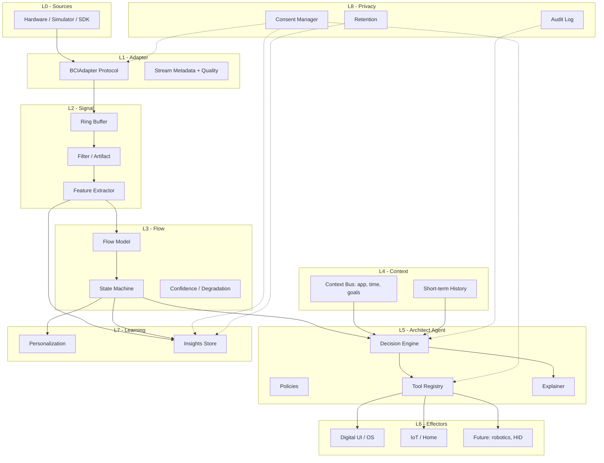
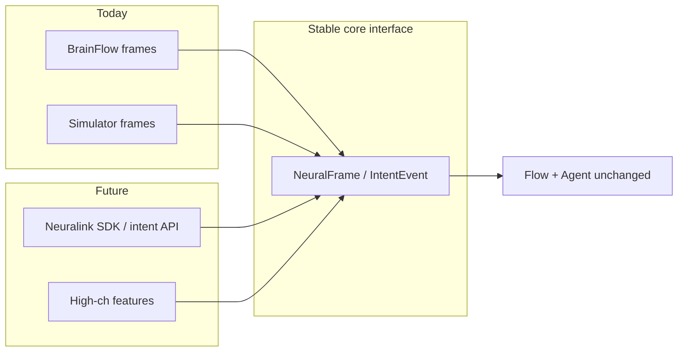

# System Architecture

**Neural Flow Architect v1.0 Foundation**  
**Status:** Normative design for Phase 0–2 implementation

## 1. Goals

- Real-time, low-latency path from neural samples → flow state → agent decision → environment action  
- Clean **adapter boundary** so open EEG and future high-bandwidth SDKs plug into the same core  
- **Local-first** processing with explicit consent gates on persistence and external effects  
- Modular agent tools with permission tiers and explainability  
- Maintainable Python core; optional modern web companion UI  

## 2. Layered architecture



| Layer | Responsibility | Default tech |
|---|---|---|
| L1 Adapter | Normalize samples, timestamps, channel layout, quality | Python Protocol + pydantic models |
| L2 Signal | Buffering, filtering, features | NumPy, SciPy |
| L3 Flow | Multi-dim scores + discrete states | scikit-learn / rules → optional ONNX |
| L4 Context | Non-neural context fusion | Event bus in-process |
| L5 Agent | Proactive decisions + tools | Rules engine + optional local LLM |
| L6 Effectors | Side effects in world/UI | Platform modules, Home Assistant |
| L7 Learning | Personal models, insights | Local SQLite / parquet |
| L8 Privacy | Consent, minimization, audit | First-class service, not an afterthought |

## 3. Runtime topology

### 3.1 Single-user local runtime (default)

```
┌─────────────────────────────────────────────────────────┐
│  User machine (on-device)                                │
│  ┌──────────┐  ┌────────────┐  ┌─────────────────────┐  │
│  │ Adapter  │→ │ Core loop  │→ │ Local API :8741     │  │
│  └──────────┘  │ flow+agent │  │ REST + WebSocket    │  │
│                └────────────┘  └──────────┬──────────┘  │
│                       │                   │             │
│                       ▼                   ▼             │
│                ┌────────────┐     ┌──────────────┐      │
│                │ SQLite     │     │ Companion UI │      │
│                │ sessions   │     │ (localhost)  │      │
│                └────────────┘     └──────────────┘      │
└─────────────────────────────────────────────────────────┘
```

No cloud required. Optional cloud LLM is **off** by default and must not receive raw neural samples.

### 3.2 Process model

| Process / component | Role |
|---|---|
| `nfa` core runtime | Acquisition, flow, agent, effectors |
| Companion UI | Visualization, override, insights (thin client) |
| Optional IoT bridge | Isolated process/token for Home Assistant |

## 4. Real-time streaming approach

### 4.1 Data units

- **`NeuralFrame`**: shape `(n_channels, n_samples)`, timestamp, sequence id, quality flags  
- **`FeatureWindow`**: fixed-duration (e.g. 1.0 s) hop (e.g. 0.25 s) derived features  
- **`FlowEstimate`**: continuous dimensions + confidence  
- **`FlowStateEvent`**: discrete state transition with reasons  
- **`AgentDecision`**: selected tools, explanations, permission level  
- **`ActionResult`**: success/failure, reversible flag, undo token  

### 4.2 Timing budgets (targets)

| Stage | Prototype target | Production aspirational |
|---|---|---|
| Adapter read | < 20 ms | < 5 ms |
| Features | < 50 ms / window | < 15 ms |
| Flow model | < 20 ms | < 5 ms |
| Agent policy (rules) | < 10 ms | < 5 ms |
| Agent (local LLM optional) | async, non-blocking | async |
| Effector invoke | async | async |

The control loop must **never block** on LLM or network IoT; use async tasks and timeouts.

### 4.3 Backpressure

Ring buffers drop oldest frames under overload and emit `quality.degraded` events rather than stalling the UI.

## 5. Component descriptions

### 5.1 BCI adapters (`adapters/`)

Implement `BCIAdapter`:

- `connect()` / `disconnect()`  
- `stream()` → async iterator of `NeuralFrame`  
- `metadata()` → channel names, sampling rate, source type  
- `health()` → quality summary  

Implementations:

| Adapter | Phase | Notes |
|---|---|---|
| `SimulatorAdapter` | 0 | Synthetic flow-like feature dynamics for demos/tests |
| `BrainFlowAdapter` | 1 | Open boards + file replay |
| `NeuralinkStubAdapter` | 3 prep | Interface sketch for high-level intents / features |

See [../bci/ADAPTER_LAYER.md](../bci/ADAPTER_LAYER.md).

### 5.2 Signal pipeline (`signal/`)

- Bandpass / notch (configurable)  
- Artifact heuristics (clipping, flatline, extreme variance)  
- Band power (theta, alpha, beta, gamma as available)  
- Optional connectivity / entropy features (research flags)  
- Normalization per session with warm-start from personalization  

### 5.3 Flow engine (`flow/`)

Multi-dimensional estimate:

```text
engagement ∈ [0,1]
arousal_balance ∈ [0,1]   # mid-high optimal, not max
self_ref_proxy ∈ [0,1]    # lower often better for flow proxy
effort_ease ∈ [0,1]
confidence ∈ [0,1]
```

Discrete states:

```text
unknown | low | pre_flow | flow | deep_flow | post_flow | fatigued
```

State machine with hysteresis to avoid flicker; personal thresholds via `personalization/`.

### 5.4 Architect agent (`agent/`)

See [../agent/ARCHITECT_AGENT.md](../agent/ARCHITECT_AGENT.md).

Decision framework:

1. Observe `FlowEstimate` + context + user preferences  
2. Select **mode**: protect | re_enter | transition | idle  
3. Choose tools under permission policy  
4. Emit explanation  
5. Execute with timeout; record outcome for learning  

### 5.5 Environment orchestration (`environment/`)

- `DigitalOrchestrator`: focus mode, notification policy, UI density hints  
- `PhysicalOrchestrator`: lights, media, climate (gated)  
- `NullOrchestrator`: safe default / dry-run  

### 5.6 Personalization & insights

- Profile store: thresholds, preferred protect actions, time-of-day priors  
- Session store: aggregated features (not necessarily raw samples)  
- Insights: “best flow hours”, task correlations, acceptance rates of agent actions  

### 5.7 Privacy layer

- Granular consent scopes: `acquire`, `persist_features`, `persist_raw`, `iot_control`, `export`, `optional_llm`  
- Retention policies (default: ephemeral raw, short-lived features, user-owned insights)  
- Audit log of agent actions and consent changes  

## 6. Technology recommendations

| Concern | Recommendation | Rationale |
|---|---|---|
| Core language | Python 3.11+ | ML/neuro ecosystem, speed of iteration |
| Validation | Pydantic v2 | Safe configs and event schemas |
| Numerics | NumPy / SciPy | Ubiquitous, auditable |
| Classical ML | scikit-learn | Personal models without heavy deps |
| Optional DL | ONNX Runtime | Portable inference, no train-time cloud need |
| CLI | Typer + Rich | Accessible local DX |
| API | FastAPI or Starlette (Phase 1) | Local REST/WS; optional dep |
| Streaming | asyncio + websockets | Non-blocking companion UI |
| Agent (rules) | In-repo policy engine | Deterministic, testable, offline |
| Agent (LLM) | Local tool-calling model optional | Never required for MVP |
| IoT | Home Assistant API | Open, user-controlled smart home |
| Storage | SQLite | Local, zero-ops |
| Frontend | Vite + React/TS (or Svelte) | Fast companion UI; large targets CSS |
| Packaging | hatchling / pip | Standard PyPA |
| Lint/type | ruff + mypy | Low-friction quality |

**Not recommended as defaults:** cloud vector DBs for neural data, always-on SaaS LLM with sample upload, hard dependency on a single headset vendor SDK in core.

## 7. Mapping prototype → high-bandwidth production



Only **adapters** and possibly **feature extractors** specialize; flow semantics, agent tools, privacy, and UI stay stable.

## 8. Configuration

- `configs/default.yaml` — safe defaults  
- Environment variables `NFA_*` override  
- Per-user profile under `data/profiles/<id>/` (gitignored)  

## 9. Failure modes

| Failure | System behavior |
|---|---|
| Signal loss | Enter `unknown`, stop proactive physical actions, keep UI override alive |
| Low confidence | Prefer idle / soft digital suggestions only |
| IoT timeout | Fail soft, explain, do not retry aggressively |
| Agent error | Safe default: no action; log |
| Consent revoked | Immediate stop of scoped processing |

## 10. Extension points

1. New `BCIAdapter`  
2. New `FeatureExtractor`  
3. New `FlowModel`  
4. New agent `Tool` with permission metadata  
5. New `Orchestrator` backend  
6. New insight report  

## 11. Non-goals (foundation)

- Multi-tenant cloud hosting of raw neural data  
- Autonomous financial or legal actions  
- Medical diagnosis  
- Stimulation control in Phase 0–2  

## 12. Related documents

- [Agent design](../agent/ARCHITECT_AGENT.md)  
- [Adapter layer](../bci/ADAPTER_LAYER.md)  
- [Privacy & ethics](../privacy/PRIVACY_ETHICS.md)  
- [Roadmap](../roadmap/ROADMAP.md)  
