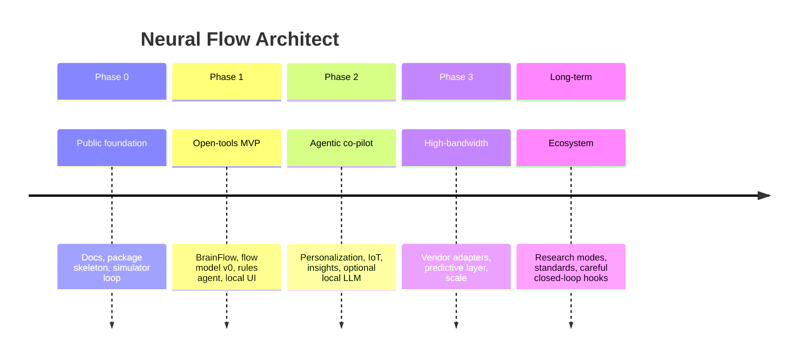

# Phased Development Roadmap

## Vision timeline

---

## Phase 0 — Public foundation (current scaffold)

**Goal:** A contribution-ready repository that runs a closed-loop **simulator demo** and documents the full product architecture.

**Deliverables**

- Product docs (vision, novelty, architecture, agent, adapters, UX, privacy)  
- Python package layout with typed core models  
- Simulator adapter + feature → flow → agent → explanation loop  
- CLI `nfa demo`  
- Unit tests for state machine and policies  
- Frontend scaffold  

**Exit criteria**

- New contributor can install and run demo in < 15 minutes  
- Architecture allows BrainFlow and future vendor adapter without core rewrite  

---

## Phase 1 — MVP with open tools

**Goal:** Researchers and developers can use open EEG / simulated data for real experiments on flow-related estimation and proactive digital support.

**Build**

- BrainFlow adapter + file replay  
- Multi-dimensional flow scores + confidence  
- Signal quality gates  
- Rules-based Architect with protect / re-enter / transition  
- Local WebSocket API  
- Companion UI live view + pause/undo  
- Consent toggles + session summary store  
- Self-report labels (“felt in flow”)  

**Exit criteria**

- 30+ minute stable session on a common open board or replay file  
- Documented latency budget measurements  
- Privacy defaults verified by checklist  

---

## Phase 2 — Full agentic co-pilot + personalization + environment

**Goal:** Daily-driver prototype for power users (still non-medical).

**Build**

- [x] Preference learning from accept/undo + self-report threshold nudges  
- [x] Longitudinal insights + gentle coaching notes  
- [x] Home Assistant optional REST path (explicit enable, soft-fail)  
- [x] Context: time-of-day, recipe, optional active_app / user_goal  
- [x] Modular multi-agent policies (Protector / ReEntry / Transition)  
- [x] Optional local LLM for explanation wording (summaries only; planning later)  
- [x] Evaluation harness for offline policy replay (`nfa eval`)  
- [x] Environment recipes: study / create / rest / social  
- [x] Signal quality gates  
- [x] Predictive precursors (opt-in)  
- [x] OS notification hooks (best-effort)  

**Exit criteria**

- Users can complete a week of sessions with improving personalization metrics  
- IoT actions safe under dry-run and rate limits  
- Undo rate trending down for default protect tools  

**Status:** Phase 2 complete for open-source foundation (July 2026). Remaining polish: full LLM tool-calling planner, OS Focus Mode deep integration, richer BrainFlow live validation.  

---

## Phase 3 — High-bandwidth / Neuralink-class integration

**Goal:** When legal, technical, and ethical access exists, plug implant-class streams into the same core.

**Build**

- Production vendor adapter (intent + features)  
- Scale tests for high channel counts  
- Richer personal neural flow signatures  
- Predictive precursor layer (research-gated)  
- Hardened audit and consent for clinical/research partners  

**Exit criteria**

- Adapter swap validated on recorded high-bandwidth-like streams  
- No regression in override/privacy guarantees  
- Clear clinical partnership docs (no PHI in public git)  

---

## Long-term vision

- Closed-loop stimulation **only if** safe APIs, ethics review, and regulation allow  
- Multi-user research features with federated aggregation defaults  
- Robotics / wearable effectors  
- Industry BCI HID bridges  
- Possible regulated product pathway evaluation (separate from community core if needed)  

---

## Priority principles across all phases

1. Ship vertical slices (signal → state → action → explain) early  
2. Never sacrifice override and local-first defaults for demos  
3. Prefer reversible digital actions before physical actuators  
4. Measure cognitive load of the co-pilot itself  

## Tracking

Operational checklist: [../../TODO.md](../../TODO.md)  
Day-1 plan: [DAY1_PROTOTYPE.md](DAY1_PROTOTYPE.md)  
